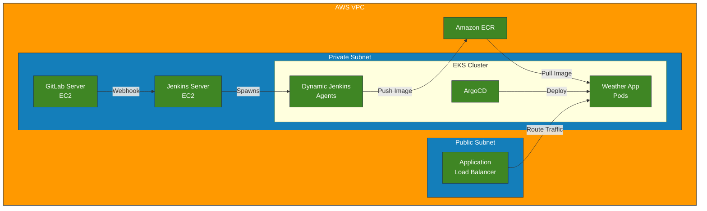

# Weather App CI/CD Project

A comprehensive Weather Application featuring a complete CI/CD pipeline, infrastructure as code, and automated deployment system.

## 📑 Index
1. [Project Overview](#-project-overview)
2. [Technologies Used](#-technologies-used)
3. [Features](#-features)
4. [Prerequisites](#-prerequisites)
5. [Initial Setup Guide](#-initial-setup-guide)
6. [Pipeline Configuration](#-pipeline-configuration)
7. [Maintenance and Monitoring](#-maintenance-and-monitoring)
8. [Architecture Diagrams](#-architecture-diagrams)

## 🛠 Technologies Used
- **Cloud Platform**: AWS (EKS, ECR, VPC)
- **Container Runtime**: Podman
- **Container Orchestration**: Kubernetes (EKS)
- **Infrastructure as Code**: Terraform
- **CI/CD**:
  - Jenkins
  - ArgoCD
  - GitLab
- **Security Tools**:
  - Trivy (Container scanning)
  - Cosign (Container signing)
  - SonarQube (Static analysis)
- **Backend**: Python Flask
- **Version Control**: GitLab (self-hosted)
- **Notification**: Slack

## 📌 Project Overview

This project consists of two main components:
1. A Python Flask-based Weather Application
2. Infrastructure as Code (IaC) for AWS deployment with complete CI/CD pipeline

The solution includes:
- Infrastructure provisioned with Terraform
- Multi-branch pipeline support
- Automated deployment using ArgoCD
- Self-hosted GitLab for version control
- Dynamic Jenkins agents running on EKS

## ✨ Features

### Infrastructure Features
- EKS Cluster with managed node groups
- Private subnet configuration for enhanced security
- Application Load Balancer (ALB) for traffic routing
- Self-hosted GitLab server on EC2
- Jenkins server with dynamic EKS agents
- ArgoCD for GitOps deployment

### Pipeline Features
- Automated security scanning with Trivy
- Static code analysis using SonarQube
- Container image signing with Cosign
- Automated versioning system
- Slack notifications for build status
- Multi-environment support (staging/production)

## 📋 Prerequisites
- AWS CLI configured with appropriate permissions
- Terraform installed
- kubectl configured
- Podman installed
- Access to AWS services:
  - EKS
  - ECR
  - VPC
  - EC2
- Jenkins with required plugins:
  - Kubernetes
  - Pipeline
  - Git
  - Credentials
  - SonarQube Scanner

## 🚀 Initial Setup Guide

### 1. Infrastructure Deployment

Create `terraform.tfvars`:
```hcl
aws_region = "us-east-1"
vpc_cidr   = "10.0.0.0/16"
environment = "production"
```

Deploy infrastructure:
```bash
cd terraform
terraform init
terraform plan
terraform apply
```

### 2. Configure GitLab
- Deploy GitLab server in private subnet
- Create two repositories:
  - Weather App Application
  - Kubernetes Manifests

### 3. Configure Jenkins
```groovy
pipeline {
    agent {
        kubernetes {
            label 'jenkins-agent'
        }
    }
    
    environment {
        VERSION = readFile('VERSION').trim()
        TRIVY_CACHE_DIR = "${env.WORKSPACE}/.cache"
        SKIP_ALL = "false"
    }
    
    stages {
        stage('Security Scan') {
            ...
        }
        // Additional stages as per Jenkinsfile
    }
}
```

## 📦 Pipeline Configuration

### Pipeline Stages

1. **Security Scan**
   - Dependency scanning with Trivy
   - Dockerfile inspection

2. **Static Analysis**
   - SonarQube integration
   - Code quality checks

3. **Build & Version**
   - Automated version bumping
   - Container image building

4. **Testing**
   - Selenium tests
   - Automated test suite

5. **Deployment**
   - Staging environment on develop branch
   - Production deployment through ArgoCD

## 🔧 Maintenance and Monitoring

### Health Checks
```bash
# Check EKS nodes
kubectl get nodes

# Check Jenkins agents
kubectl get pods -n jenkins-agents

# Check ArgoCD applications
kubectl get applications -n argocd
```

### Log Access
```bash
# Jenkins agent logs
kubectl logs -n jenkins-agents <pod-name>

# Application logs
kubectl logs -n <app-namespace> <pod-name>
```

## 🎨 Architecture Diagrams

### Infrastructure Architecture



### CI/CD Pipeline Flow

```mermaid
graph LR
    subgraph GitLabFlow["GitLab"]
        Develop["Develop Branch"]
        Main["Main Branch"]
    end
    
    subgraph Pipeline["Jenkins Pipeline"]
        Security["Security Scan"]
        Analysis["Static Analysis"]
        Build["Build & Test"]
        Deploy["Deploy"]
    end
    
    subgraph Environments["Environments"]
        Staging["Staging"]
        Production["Production"]
    end
    
    Develop -->|Merge| Main
    Main -->|Trigger| Pipeline
    Pipeline -->|Deploy to| Environments
    
    classDef git fill:#FCA121,stroke:#232F3E,color:white;
    classDef pipe fill:#335061,stroke:#232F3E,color:white;
    classDef env fill:#3F8624,stroke:#232F3E,color:white;
    
    class Develop,Main git;
    class Security,Analysis,Build,Deploy pipe;
    class Staging,Production env;
```


